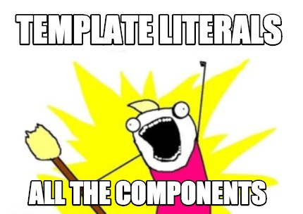

# Intl Template Literals (concept)
Just an idea about how we could write intl components. Inspired by [styled-components](https://github.com/styled-components/styled-components)

## The problem with current Intl component

Currently Intl components often look like this:
```js
<p>
  <FormattedMessage
    id="welcome"
    values={{name: <b>{name}</b>, unreadCount}}
  />
</p>
```
with somewhere else in your code the message:
```js
const messages = {
  'welcome': `Hello {name}, you have {unreadCount, number} {unreadCount, plural,
    one {message}
    other {messages}
  }`
};
```
The main problem here is that when you read your code, you don't really know what `id="welcome"` will render. If you want to know what it says, you have to find the message associated with it, which is quite annoying.

## Solution (maybe) : Template Literals



What if we could do this:
```js
<p>
  formated.message`hello ${ <b>{name}</b> } you have ${ unreadCount } messages`;
</p>
```
And then you would declare your messages the following way:
```js
const messages = {
  'hello [name] you have [unreadCount] messages': `Hello {name}, you have {unreadCount, number} {unreadCount, plural,
    one {message}
    other {messages}
  }`
};
```

## How does it work ?

Well, for now it's just a concept so it does not "work" but I know how it could (possibly) work.  
First, your messages would have to be transformed to extract the values names and replace the message's id :
`hello [name] you have [unreadCount] messages` would become `hello [___] you have [___] messages` and an array to keep values names `['name', 'unreadCount']`.  
Then the `formated.message` template would look like this:
```js
formated.message = (strings, ...interpolations) => {
  const id = strings.join('[___]');
  const values = {};
  const valueNames = getValuesNamesForId(id); // get ['name', 'unreadCount']
  interpolations.forEach((value, index) => {
    values[valueNames[index]] = value;
  });
  return (
    <FormattedMessage
      id={id}
      values={values}
    />
  );
};
```

## Is it a good idea ?

Hum... I don't know `¯\_(ツ)_/¯`.
